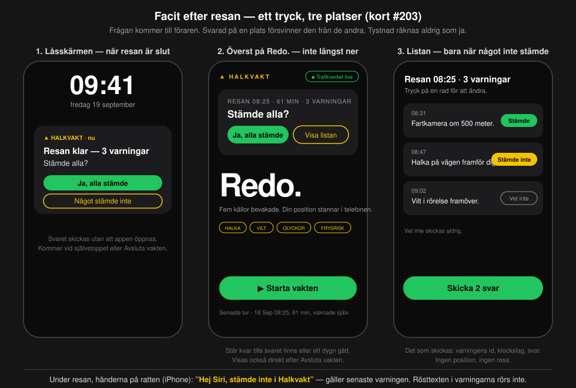

# Facit efter resan — beslutsunderlag till Axel

**Status: FÖRSLAG 2026-09-19 — väntar på Axels bedömning.** Bengt beställer; formen på S4 (facitknappen) är Axels.
Kort #203 på tavlan. Inget i appen är ändrat än.

## 0. Sammanfattning

Testförarna ska inte behöva stanna för att bekräfta en varning, och de ska kunna rapportera när appen missade något.
Förslaget: **frågan kommer till föraren efter resan** — en notis på låsskärmen, ett tryck på *Ja, alla stämde*, och bara
avvikelserna pekas ut. Under resan räcker en Siri-fras eller en stor knapp, både för *stämde inte* och för *appen
missade*. **Tystnad räknas aldrig som ja.** Det automatiska facit — arkiven och kamerabilderna — finns redan och bär
huvuddelen utan någon förare.

## 1. Läget i dag — varför det inte kommer några svar

| | |
| :-- | :-- |
| Vägen till ett svar | stanna · avsluta vakten · öppna appen · fliken Vakten · knapparna längst ner under *Senast sagt* |
| Vad som går att svara på | bara resans **sista** varning |
| Fälttest 1 (16/9) | Bengt nådde bara brytaren — knapparna låg i en vy ingen visar (DECISIONS #210) |
| Fälttest 2 (18/9) | samma sak: bygget 0.3.7 (10) i TestFlight saknade rättelsen (DECISIONS #240); main bär 0.3.8 (11) |
| Riktiga svar i `driver_facit` | **0** (två provrader) |
| Domen i januari behöver | ≥ 30 svar från ≥ 5 förare, ingen förare > 25 % (KB-D4) |

Bengt 19/9: *"som det är i dag är det oerhört krångligt och jag tror att det inte kommer att komma många svar."*

## 2. Principen: undantagsprincipen med underskrift

Bengts tanke: appen är så bra att svaren kan automatiseras — föraren meddelar bara när maskinen hade fel. **Rätt om
bördan, fel om tystnaden.** Tystnad betyder lika ofta *såg inte*, *kunde inte bedöma*, *telefonen låg i fickan* eller
*appen var trasig*. Fälttesten 16/9 och 18/9 gav noll svar för att knapparna saknades — med tystnad = ja hade båda
resorna bokförts som bekräftelser av en app som inte fungerade. Ett facit som antar det som ska prövas kan inte pröva
det, och skevheten går åt farligaste hållet: falsklarmen (KB-B:s tak 25 %) skulle underskattas.

Därför: **svaret är en handling, men handlingen kan vara EN per resa.** *Ja, alla stämde* med ett tryck, eller peka ut
avvikelsen. *Vet inte* skickas aldrig. En resa utan tryck ger inga rader.

**Förslag till TROSKLAR-KOMBINATIONEN (fastställt dokument ⇒ Bengt + Axel): KB-D5 — ett svar är en handling; tystnad
är inget svar.** Kontroll i domen: resor svarade med *Ja, alla* jämförs med resor svarade rad för rad; skiljer sig
andelen *stämde* markant är *Ja, alla* en vana och räknas ner.

## 3. Vad automatspåret redan gör — utan förare

| Varning | Maskinen kontrollerar själv, i efterhand | Bara föraren ser |
| :-- | :-- | :-- |
| Frysrisk / efterhalka | uppspelningen: gick ytan under noll och var den blöt *efter* varningen? (en senare mätning är en annan mätning — tillåtet facit) · kamerabilden | svag — svart is syns inte; värdet är *stämde inte* på torr väg |
| Halka (segment) | kamerabilden vid varningen · stationerna · olycksarkivet | om vägen faktiskt var hal |
| Vattenplaning | radar + station (grind V-B) · kamerabilden | om det stod vatten |
| Olycka | Trafikverkets olycksarkiv — sant per definition | om kön fanns kvar |
| Fartkamera | Trafikverkets data, fältverifierad 2/9 | kontrollfråga: *stämde inte* = fel i kanalen eller geometrin |
| Vilt | polisens händelser | vilt syns sällan — *stämde* säger lite |
| **Missar** — halt utan varning | **ingenting**: maskinen vet inte var den var tyst | **bara föraren** |

Slutsats: förarkanalen ska bära två saker som ingen maskin ger — *stämde inte* och *appen missade* — och därför vara
nästan gratis att använda.

## 4. Förslaget i fyra lager

1. **Efter resan (grunden, båda plattformarna).** Appen sparar resans varningar lokalt (id, klockslag, text). När
   vakten stannar — manuellt eller självstoppet efter 15 min — och något är obesvarat: notis *"Resan klar — stämde alla 3
   varningarna?"* med knapparna i notisen, kort överst på *Redo.*, lista bara vid avvikelse. Skickas som i dag: id,
   klockslag, svar per varning.
2. **Siri under resan (iPhone).** App Shortcuts bredvid *Starta/Stoppa vakten*: *"Hej Siri, stämde inte i Halkvakt"*
   ⇒ svar på senaste varningen om den är yngre än 10 min; Siri säger *"Tack."*. Händerna på ratten, fungerar via CarPlay
   och bilens Bluetooth, **ingen mikrofonbehörighet** — Siri lyssnar, inte appen.
3. **Valfritt:** knapparna i körläget när bilen stått stilla ≥ 5 s och en varning är yngre än 10 min.
4. **Missarna — appen var tyst när den borde varnat.** Se §6.

## 5. Placeringen — frågan kommer till föraren

| Plats | När | Vad föraren gör |
| :-- | :-- | :-- |
| **Låsskärmen** | direkt när resan är slut | ett tryck på *Ja, alla stämde* i notisen — appen behöver inte öppnas (iOS: notisåtgärd i bakgrunden; Android: notisåtgärd + WorkManager) |
| **Överst på Redo.** | nästa gång appen öppnas, och direkt efter *Avsluta vakten* | samma tryck; kortet står kvar tills svaret finns eller ett dygn gått |
| **Listan** | bara om något inte stämde | tryck på raden växlar Stämde / Stämde inte / Vet inte; sedan *Skicka* |

Svarad på en plats försvinner frågan från de andra. Brytarens text skrivs om: *"Efter varje resa frågar appen om
varningarna stämde — ett tryck. Det som skickas är varningens id, klockslaget och ditt svar …"*

## 6. Missarna — det andra halva facit

Nettonyttan (KB-B) behöver missarna lika mycket som träffarna: en app som varnar rätt men missar hälften är inte till
nytta. Maskinen kan inte se sina egna missar, så det här är förarens viktigaste uppgift.

**I ögonblicket — ett ord eller ett tryck:**
- iPhone: *"Hej Siri, appen missade i Halkvakt"* (eller *"halt här i Halkvakt"*).
- Båda plattformarna: en stor knapp i körläget, **Appen missade**, som ett tryck på en monterad telefon. Android
  saknar Siri-vägen, så knappen är Androids väg.

Appen sparar då, **på telefonen**: klockslaget och närmaste mätstation (finns alltid) samt närmaste vägavsnitt om det
ligger inom 2 km — som id:n, samma ordförråd som varningarna (`wx:2135`, `seg:16010`). Ingen koordinat.

**Efter resan** dyker missen upp som en rad i listan: *"08:52 · Du markerade: appen missade — vad?"* med
**Halka / Vatten / Vilt / Olycka / Annat**. Så blir handgreppet i bilen ett ord, och tanken kommer efteråt.

**Vad som skickas:** klockslag, typ, station-id, segment-id, app, version — i en ny tabell `driver_miss`, låst som
`driver_facit`. **Integriteten:** samma uppgiftsklass som ett varnings-id (ungefär var man var just då), men utlöst av
föraren i stället för av appen. Brytarens text måste säga det: *"Markerar du att appen missade något skickas också
klockslaget och närmaste mätstation — det säger ungefär var du var just då."* Bara betatestare, bara med brytaren på.

**I domen:** en miss kontrolleras mot arkiven precis som en varning — var stationen kall och blöt vid klockslaget,
vad visar närmaste kamerabild? Förarfacit ensamt fäller eller friar fortfarande ingen dom (KB-D3).

## 7. Vad som inte ändras

- **Rösttexten** i varningarna rörs inte (fältverifierad).
- **Integritetslöftet:** ingen position, ingen resa lämnar telefonen. Det som skickas är id:n, klockslag och svar —
  och det står i brytarens text innan föraren slår på den.
- **Databasen för svaren:** `driver_facit` oförändrad (`ja`/`nej`); *Vet inte* skickas aldrig. Missarna får egen tabell.
- **Regel T:** facit utlöser ingenting; det bara mäter.

## 8. Vad Axel ska bedöma

| # | Beslut | Claudes rekommendation |
| :-- | :-- | :-- |
| 1 | Undantagsprincipen med underskrift — ett tryck *Ja, alla stämde*; KB-D5 *tystnad är inget svar* | ja; KB-D5 kräver Bengt + Axel |
| 2 | Placeringen: knapparna i notisen på låsskärmen · kortet överst på *Redo.* · listan vid avvikelse | ja, alla tre i första bygget |
| 3 | Siri-fraser på iPhone: *stämde inte i Halkvakt* · *appen missade i Halkvakt* (+ *stämde i Halkvakt*?) | de två första |
| 4 | Missarna: klockslag + typ + station-id (+ segment-id) i `driver_miss`; brytarens text vidgas | ja — integritetsbeslutet är Axels |
| 5 | Stor knapp *Appen missade* i körläget (Androids väg, iPhone reserv) | ja |
| 6 | Lager 3 — svarsknapparna i körläget vid stillastående | nej i första bygget; låsskärmen + Siri räcker |
| 7 | Byggordning: **A)** 0.3.8 (11) ut nu som det är, #203 i 0.3.9 · **B)** vänta, allt i 0.3.8 | **A** — 0.3.8 bevisar sändkanalen från en riktig telefon, vilket aldrig skett |
| 8 | Android i samma varv (LastSaidCard har samma begränsning: bara sista varningen) | ja, en PR |

## 9. Kostnad och ordning

- **Kod:** Claude skriver båda plattformarna; Axel granskar och bygger iOS (Xcode → TestFlight); Android byggs av CI.
  Uppskattning: iOS ~350 rader (reselogg, kort, lista, notisåtgärder, två intents, missknappen), Android ungefär lika.
- **Actions:** varje Android-push ≈ 15 min (två jobb) + CI 2 min; 2–3 pushar ⇒ ~45 min, inom septembers ~80 min/dygn.
- **Server:** migration `driver_miss` via dbknapp; `facit-svar` tar emot missar; vakthundens förarfacit-rad räknar dem.
- **Ordning:** (1) Axel svarar på §8 · (2) 0.3.8 (11) ut om A · (3) iOS-PR + Android-PR · (4) Axels bygge 0.3.9 ·
  (5) Bengts provkörning: en resa med minst två varningar, ett tryck på låsskärmen.

## 10. Byggnoter (det som redan finns)

- iOS: `Facit.swift`/`FacitSender.swift` (kö, sändning när vakten är av), `HeadsUpService` (notisbehörighet finns),
  `HalkvaktShortcuts` (App Shortcuts med fraser för start/stopp), `GuardManager.history` (resans varningar, ej
  persistent), `lastMovedAt` (stillastående).
- Android: `LastSaidCard` med knapparna, `Prefs.facitEnabled`, notiskanal i `GuardService`, `POST_NOTIFICATIONS`.
- Server: `facit-svar` (204 på svar), `driver_facit` med `prov`-kolumnen (kort #196), skuggrapportens `forarfacit`.

## 11. Bevis (Verify)

1. En resa med ≥ 2 varningar, besvarad med ett tryck på låsskärmen utan att appen öppnats ⇒ lika många rader i
   `driver_facit`; en resa utan tryck ⇒ 0 rader.
2. Ett svar via Siri ⇒ rad med `app = ios` och varningens klockslag.
3. En miss markerad under resan och klassad efter den ⇒ en rad i `driver_miss` med typ, station-id och klockslag —
   och uppspelningen kan hämta stationens mätningar för det klockslaget.
4. PRODUKTBOK uppdaterad med skärmbilder i samma commit (PRODUKTBOKSREGELN).
