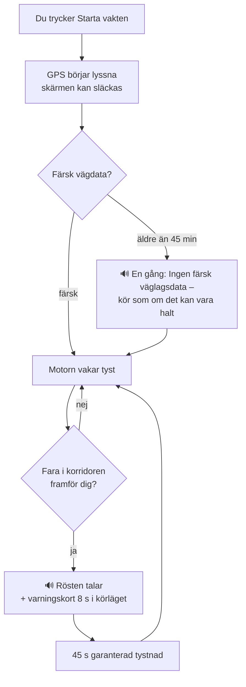
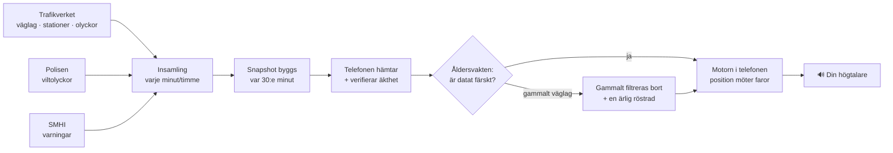

# 📖 PRODUKTBOKEN — Halkvakt genom användarens ögon

Levande dokument (regel i CLAUDE.md): **ändras något användaren ser, hör eller
gör, uppdateras den här boken i samma varv** — med färska skärmbilder från
fotostudion (CI fotar tre skärmar vid varje push). Teknikens djup bor i
SYSTEM.md; här bor upplevelsen.

*Uppdaterad 2026-08-29 · speglar Android v0.3.0 + åldersvakten + vilt-datat*

---

## Vad är Halkvakt? (30 sekunder)

En app du startar när du sätter dig i bilen — sedan lägger du undan telefonen.
Halkvakt lyssnar på Trafikverkets mätstationer och rapporterade väglag och
**säger till med rösten** (i högtalaren eller bilens Bluetooth) när något farligt
finns framför dig: halka, frysrisk, olyckor, vilt, fartkameror. Ingen skärm att
titta på, inget konto, ingen position som lämnar telefonen. Tystnad är
grundläget — pratar den, betyder det något.

## Så ser den ut

| Vakten | Inställningar | Om |
|---|---|---|
|  |  |  |

*(Körläget — skärmen med det stora varningskortet under färd — fotas i nästa
utbyggnad av fotostudion.)*

## Första gången (2 minuter)

1. **Åldersfrågan** — appen är för den som kör bil.
2. **Platsbehörighet** — "Tillåt alltid" krävs för att vakten ska fungera med
   släckt skärm. Positionen används bara lokalt i telefonen.
3. Klart. Inga konton, ingen e-post, inga fler frågor.

## De tre flikarna

**🛡 Vakten** — hjärtat. En stor knapp startar/stoppar vakten. Under den:
LIVEDATA-pillen och raden **"N faror · väglag 06:10"** — tiden är *datans*
ålder, inte nedladdningens (så du ser om underlaget är färskt). Kategoriswitchar
låter dig stänga av t.ex. fartkameror; av-slagen kategori varnar aldrig.

**🚗 Körläge** — det du ser om telefonen sitter i hållaren: mörk skärm, stora
siffror (hastighet, avverkad sträcka, antal varningar) och när något händer ett
**varningskort i 8 sekunder** med samma text som rösten just sa. Byggd för att
ögonen ska stanna på vägen.

**📍 Nära dig** — listan över faror inom närområdet just nu, sorterade på
avstånd, med riktning. För nyfikenhet före avfärd — under körning sköter rösten
allt.

**⚙️ Inställningar** — förvarningsavståndet (hur långt i förväg rösten ska
tala, skjutreglage), röst av/på per kategori.

**ℹ️ Om** — löftet i klartext: *"Din position lämnar aldrig telefonen. Vi
samlar in: ingenting."* Plus ärlighetsraden: *"Varnar vid Trafikverkets
mätstationer och rapporterade väglag — mellan stationerna är vägen oövervakad."*

## Exakt vad rösten säger

| När | Frasen |
|---|---|
| Lindrig olycka framför dig | "Olycka rapporterad 3 kilometer framför dig." |
| **Allvarlig olycka — tidigt ropet, ca 10 km** | "Allvarlig olycka 10 kilometer framför dig — stor påverkan på trafiken. Överväg annan väg. Beräknas röjd vid 14:20." |
| **Allvarlig olycka — påminnelsen, ca 2 km** | "Sakta ner — olycksplats strax framför dig." |
| **Allvarlig olycka du kom nära utan att höra det tidiga ropet** | "Allvarlig olycka 2 kilometer framför dig — stor påverkan. Sakta ner." |
| Rapporterad halka på din väg | "Varning: halka rapporterad på vägen framför dig." |
| Mätstation visar frysrisk | "Isrisk framöver — vägbanan nära noll grader." |
| Färsk viltolycka i området | "Viltrisk — vanlig olycksplats för älg den här tiden." |
| Fartkamera | "Fartkamera om 500 meter. Gränsen är 80." |
| Väglagsdatat är gammalt (en gång per körning) | "Ingen färsk väglagsdata – kör som om det kan vara halt." |

**Allvarlig olycka — varför två gånger?** Trafikverket klassar varje olycka efter
hur mycket den påverkar trafiken. Är påverkan *mycket* stor — riktigt stopp — säger
Halkvakt till *tidigt*,
runt en mil innan, medan det fortfarande finns avfarter kvar att välja. Det är
hela poängen: du ska hinna bestämma dig innan du sitter fast. Sedan kommer en
kort påminnelse strax innan olycksplatsen, som bara handlar om farten.
Röjningstiden läses upp när Trafikverket angett en.
Halkvakt räknar **aldrig** ut omvägen åt dig — det gör din kartapp. Vi levererar
beslutet i tid, du väljer vägen. Inga knappar att trycka på under körning.

**Röstens uppförandekod:** aldrig mer än en varning per 45 sekunder; samma fara
upprepas först efter 10 minuter *och* 5 km (enda undantaget är den allvarliga
olyckans två steg ovan, som är två olika budskap — inte samma sagt två gånger); står två faror samtidigt framför dig
vinner den allvarligaste (olycka > halka > frysrisk > vilt > kamera) och den
andra **droppas** — köas aldrig upp till tjat. Under 15 km/h: tyst (du står
still eller kör på parkering).

## Flöde 1 — en körning

## Flöde 2 — datans väg till din högtalare

Allt till höger om "Telefonen hämtar" sker **lokalt i din telefon** — därav
löftet: positionen möter faroläget hos dig, aldrig hos oss.

## Vad appen inte gör

Ingen prognos (varnar på uppmätt läge, inte gissningar), tyst mellan
mätstationerna, ingen ködetektion ännu (kommer som uppdatering 1). Hela ärliga
listan: [SYSTEM.md §4](SYSTEM.md).

## iOS då?

Samma app, samma röst, samma löfte — skriven och väntar på sitt första bygge
på Axels Mac (måndag). Produktboken gäller båda; skiljer sig något kommer det
stå här.

## iOS-utgåvan (byggd 29/8 2026)

Samma tre flikar, samma texter, samma motor — skillnaderna är plattformens:
flikraden är iOS 26:s svävande "glaspill" i stället för Androids fasta rad,
och överst på varje flik sitter varumärkesraden **⚠ HALKVAKT** med en liten
statuspill till höger på Vakten-fliken (LIVEDATA i vila, VAKTEN PÅ under
körning). Skärmbilder tas från Axels iPhone (CI:n kan bara fota Android).
