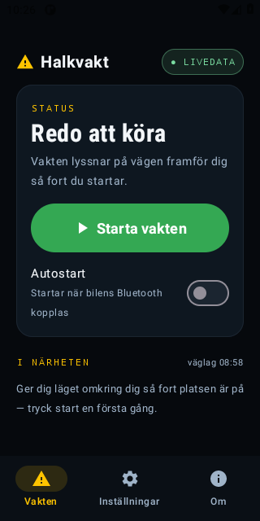
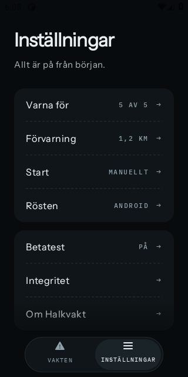
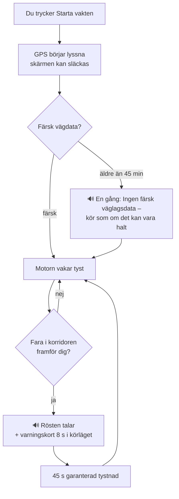
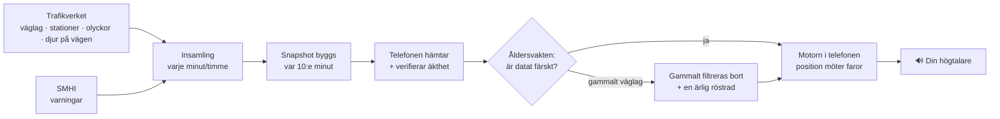
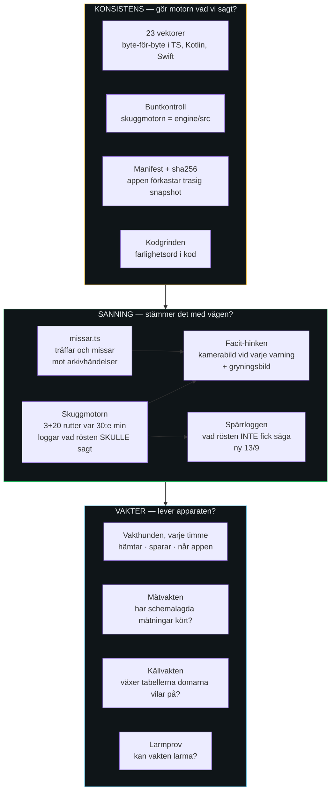

# 📖 PRODUKTBOKEN — Halkvakt genom användarens ögon

Levande dokument (regel i CLAUDE.md): **ändras något användaren ser, hör eller
gör, uppdateras den här boken i samma varv** — med färska skärmbilder från
fotostudion (CI fotar tre skärmar vid varje push). Teknikens djup bor i
SYSTEM.md; här bor upplevelsen.

*Uppdaterad 2026-09-13 · speglar iOS 0.3.5 (8) med skinnet v3, självväckningen, fyra
länder, broarna och den prioritetsmedvetna rösten. Android (0.3.1) släpar efter på skinnet
— Play-lanseringen väntar på tolv testare. Skärmbilderna nedan är från Android v0.3.0 och
visar gårdagens utseende; iOS ser ut som avsnittet "Skinnet" beskriver.*

---

## Vad är Halkvakt? (30 sekunder)

En app du startar när du sätter dig i bilen — sedan lägger du undan telefonen.
Halkvakt lyssnar på Trafikverkets mätstationer och rapporterade väglag och
**säger till med rösten** (i högtalaren eller bilens Bluetooth) när något farligt
finns framför dig: halka, frysrisk, olyckor, vilt, fartkameror. Ingen skärm att
titta på, inget konto, och ingen position lämnar telefonen av sig själv — det enda som
någonsin skickas är betatestets facitsvar, som du själv slår på (se Om). Tystnad är
grundläget — pratar den, betyder det något.

## Så ser den ut

| Vakten | Inställningar | Om (nu sist i Inställningar) |
|---|---|---|
|  |  |  |

*(Bilderna är Android, fotostudion 16/9. iOS 0.3.5 har skinnet v3 — se avsnittet nedan. Om-fliken
finns inte längre: två flikar, Om är sista avsnittet i Inställningar — bilden visar slutet av
Inställningar med betatest-brytaren och början av Om.)*

### Facitknappen (betatestet, S4 — Android 16/9)

| Senast sagt med knapparna | Betatest-brytaren i Inställningar |
|---|---|
|  |  |

*(Fotostudion 16/9. Knapparna syns bara när betatestet är påslaget och varningen bär ett id.)*

## Skinnet (v3, iOS 0.3.3 →)

Ritat om från grunden 31/8 och portat till iOS samma kväll. Mörkt, tyst, ett ord i taget.

**Hemskärmen säger ett ord: "Redo."** — i stort, i Instrument Sans. Under det en grön knapp,
*Starta vakten*. Ingen karta, inga siffror att tolka. Under knappen ett litet kvitto:
*"Ingen tur än."* eller *"Vaknade själv 07:14 · körde 38 min"* — det senare är
självväckningens spår (se nedan).

**Körläget:** *PÅ VAKT* i grönt, resan i siffror (*"42 min · 38 km"*), tre räknare
(varningar, halka, vilt), en gul panel *Senast sagt*, och listan *På din väg*. Längst ner
en konturknapp *Avsluta vakten*. Håll fingret på *PÅ VAKT* en sekund så visas ett
demo-varningskort — så du kan se hur det ser ut utan att vänta på is.

**Varningskortet:** helgult. Överst triangeln — Halkvakts märke, aldrig farans ikon.
Under den farans namn i 64 punkter med farans egen ikon intill, avståndet i monospace,
rösten i kursiv, och en stapel som rinner ner under åtta sekunder. **Ingen knapp** — du ska
inte trycka på något i en bil.

**Ikonsetet:** fem faror, fem former, en linje. *Halt väglag* är bilen som tappar greppet
(vågspåren redan gjorda — det ÄR halt). *Frysrisk* är termometer och iskristall (det KAN
bli halt). *Olycka* är samma bilkropp med en islagsstjärna. *Vilt* är ett hjorthuvud
framifrån, hornen bär igenkänningen. *Fartkamera* är en låda på stolpe, den enda på stolpe.
Samma fem på iOS och Android.

**Två flikar, inte tre.** Om-innehållet — löftet, ärlighetsraden, dataattributionen — är
sista avsnittet i Inställningar. Inget att leta efter, inget att missa.

## Första gången (2 minuter) — introduktionen

Fyra sidor, helskärm, en gång. Sida två ber om plats och trappar upp till *Tillåt alltid*
(iOS visar "medan appen används" först — Halkvakt frågar en gång till). Sida tre ber om
notiser för bannern. **Båda sidorna kvittar**: en grön bock när det är klart, en gul rad
med vägen till Inställningar om du sa nej. Sida fyra: *"Du är klar."* — Siri och
självväckningen är huvudvägen; Genvägar är valfritt under Inställningar. Vill du se
introduktionen igen finns *Visa introduktionen igen* längst ner i Inställningar.

Introduktionen visas en gång, fyra sidor. Allt går att hoppa över och ändra senare;
den kan visas igen från Inställningar.

1. **Löftet** — vad Halkvakt gör, och ordagrant: *"Din position lämnar aldrig telefonen. Vi samlar in:
   ingenting — om du inte själv slår på betatestets facit i Inställningar."*
2. **Platsen** — *Tillåt plats* ("Vid användning") — det räcker för att rösten ska tala
   med släckt skärm. Nästa gång du kör frågar iOS om "Alltid", som behövs för att vakten
   ska starta av sig själv.
   **iOS egen ruta** säger (ordagrant, `project.yml`): *"Halkvakt jämför din position med
   vägfaror lokalt i telefonen och varnar med rösten, även med släckt skärm under körning.
   Ingen position lämnar telefonen av sig själv — det enda som skickas är betatestets
   facitsvar, som du själv slår på."* Och vid *Alltid*: *"Med "Alltid" startar vakten av sig
   själv när du börjar köra. Matchningen sker lokalt i telefonen — ingen position lämnar den
   av sig själv."* Skärmbild av rutan kommer ur första bygget som bär texten (0.3.9 (13)).
3. **Bannern** — *Tillåt notiser*, så att varningen syns över kartappen.
4. **Du är klar** — två sätt att starta: knappen i appen, eller *"Hej Siri, starta
   Halkvakt"* med telefonen i facket. Inget mer att ställa in. Vakten stoppar sig själv
   när bilen stått still en kvart. Helautomatisk start i bilen är valfritt och finns
   under Inställningar → Autostart i bilen.

Klar. Inga konton, ingen e-post, inga fler frågor.

*(Android: behörigheterna frågas i trappa första gången man trycker Starta; autostarten
lär sig bilen själv. Samma introduktion byggs där i nästa varv.)*

## Flikarna (två sedan 31/8)

**🛡 Vakten** — hjärtat. En stor knapp startar/stoppar vakten. Under den:
LIVEDATA-pillen och raden **"N faror · väglag 06:10"** — tiden är *datans*
ålder, inte nedladdningens (så du ser om underlaget är färskt). Kategoriswitchar
låter dig stänga av t.ex. fartkameror; av-slagen kategori varnar aldrig.

**🚗 Körläge** — det du ser om telefonen sitter i hållaren: mörk skärm, stora
siffror (hastighet, avverkad sträcka, antal varningar) och när något händer ett
**varningskort i 8 sekunder** med samma text som rösten just sa. Byggd för att
ögonen ska stanna på vägen.

**📍 Nära dig** — listan över faror inom närområdet just nu, sorterade på
avstånd, med riktning. För nyfikenhet före avfärd — under körning sköter rösten
allt.

**⚙️ Inställningar** — förvarningsavståndet (hur långt i förväg rösten ska
tala, skjutreglage), röst av/på per kategori. Och betatestets brytare *Svara på varningarna*
— **av tills du själv slår på den** — med texten om exakt vad som skickas (se Om).

**ℹ️ Om** (sista avsnittet i Inställningar) — löftet i klartext: *"Din position lämnar
aldrig telefonen. All matchning mot vägdata sker lokalt i appen. Inget konto, ingen spårning."*
Och sedan 16/9 undantaget, ordagrant som i appen (Axels krav, DECISIONS #196): *"Undantaget är
betatestet, om du själv slår på det: då skickas varningens id, klockslag och ditt svar
(Stämde / Stämde inte) — det säger ungefär var du var när rösten talade. Inget annat."*
Plus ärlighetsraden: *"Varnar vid
Trafikverkets mätstationer och rapporterade väglag — mellan stationerna är vägen
oövervakad."* Och attributionen: Trafikverket (CC0), SMHI, Fintraffic (CC BY 4.0),
broar © OpenStreetMap-bidragsgivare (ODbL).

## Exakt vad rösten säger

| När | Frasen |
|---|---|
| Lindrig olycka framför dig | "Olycka rapporterad **på väg 25**, 3 kilometer framför dig." |
| Bro nära frysande station (0.3.3) | "Frysrisk framöver — bro om 700 meter." |
| **Allvarlig olycka — tidigt ropet, ca 10 km** | "Allvarlig olycka **på E18**, 10 kilometer framför dig — stor påverkan på trafiken. Överväg annan väg. Beräknas röjd vid 14:20." |
| **Allvarlig olycka — påminnelsen, ca 2 km** | "Sakta ner — olycksplats strax framför dig." |
| **Allvarlig olycka du kom nära utan att höra det tidiga ropet** | "Allvarlig olycka 2 kilometer framför dig — stor påverkan. Sakta ner." |
| Rapporterad halka på din väg — kod 2 eller högre, eller kod 1 med is, snö, frost, halka, halt, halkrisk, halkig eller *mycket besvärligt* (det sista sedan 22/9, kort #156; sedan 16/9 även i sammansättningar: *Rimfrost*, *Nysnö*, *Blötsnö*; motåtgärder som *Halkbekämpning* tiger) | "Varning: halka rapporterad på vägen framför dig." |
| Mätstation visar frysrisk | "Isrisk framöver — vägbanan nära noll grader." |
| Djur på vägen enligt Trafikverket — älg, hjort, vildsvin, men också lösa kor och får (sedan 22/9, DECISIONS #318; polisens länspunkter är borta) | "Viltrisk framöver." |
| Fartkamera | "Fartkamera om 500 meter. Gränsen är 80." |
| Väglagsdatat är gammalt (en gång per körning) | "Ingen färsk väglagsdata – kör som om det kan vara halt." |

**Allvarlig olycka — varför två gånger?** Trafikverket klassar varje olycka efter
hur mycket den påverkar trafiken. Är påverkan *mycket* stor — riktigt stopp — säger
Halkvakt till *tidigt*,
runt en mil innan, medan det fortfarande finns avfarter kvar att välja. Det är
hela poängen: du ska hinna bestämma dig innan du sitter fast. Sedan kommer en
kort påminnelse strax innan olycksplatsen, som bara handlar om farten.
Röjningstiden läses upp när Trafikverket angett en.

**Rösten säger VAR (2/9):** vägnumret följer med i olycksfrasen — *"på E18"*, eller *"på
väg 25"* när numret saknar bokstav, så talsyntesen inte säger "olycka på 25". Saknar
Trafikverket vägnummer är frasen som förr. Bara olyckor: halka och frysrisk gäller
sträckan du redan kör på, och där tillför "på E4" inget.
Halkvakt räknar **aldrig** ut omvägen åt dig — det gör din kartapp. Vi levererar
beslutet i tid, du väljer vägen. Inga knappar att trycka på under körning.

**Röstens uppförandekod:** samma fara upprepas först efter 10 minuter *och* 5 km (enda
undantaget är den allvarliga olyckans två steg ovan, som är två olika budskap); står två
faror samtidigt framför dig vinner den allvarligaste (olycka > halka > frysrisk > vilt >
kamera) och den andra **droppas** — köas aldrig upp till tjat. Under 15 km/h: tyst.

**Spärren mellan varningar (ändrad 13/9):** minst 10 sekunder mellan två varningar av
samma eller lägre tyngd — men **en viktigare fara får bryta spärren**. Förr var spärren
45 sekunder och blind: en fartkamera kunde tysta isen som kom 20 sekunder senare, och när
spärren öppnade var isen 61 meter bort. Nu får is avbryta en kamera; en kamera kan aldrig
avbryta is. Tio sekunder är räknat ur att två fartkameror i samma riktning aldrig ligger
närmare än 520 meter — så en kamera kan aldrig tystas av golvet.

**Och en sak Halkvakt medvetet INTE gör (Bengts fältdom 12/9):** dämpar inte sanna
varningar som upprepas. Kör du åtta mil på is säger rösten *"halka"* var tionde minut, för
det ÄR halt. "Cry wolf" handlar om falska varningar — det är falskheten som äter
förtroendet, inte upprepningen. Mot uppmärksamhetsförfall under två monotona timmar är
upprepning rätt design.

## Broarna (0.3.3)

Broar fryser före vägen. Halkvakt känner till varje bro på riks- och europavägarna (ur
OpenStreetMap) och säger till när närmaste vägväderstation ligger nära noll och det är
vått: *"Frysrisk framöver — bro om sjuhundra meter."* Tröskeln för bron är +3 grader,
högre än vägens +1, för att brobanan kyls från två håll. Det är en mätning plus ett
faktum — ingen prognos. Är stationen varmare än tre grader tiger vakten om bron.
2 476 broar ligger i appen (OpenStreetMap, ODbL). I september är listan tom i snapshoten —
ingen station är nära noll — så du hör dem först i höst.

## Flöde 1 — en körning



## Flöde 2 — datans väg till din högtalare



Allt till höger om "Telefonen hämtar" sker **lokalt i din telefon** — därav
löftet: positionen möter faroläget hos dig, aldrig hos oss.

**Sedan 8/9 går hela kedjan utanför GitHub.** Insamling varje minut, snapshot var tionde,
kartsajt var trettionde — allt i Supabase. Det hände efter att appen serverat tre dygn
gammal data när en byggkvot tog slut. Åldersvakten höll: rösten sa *"Ingen färsk
väglagsdata"* i stället för att hitta på. Men den hade inget att säga. Nu finns dessutom en
vakthund som varje timme kontrollerar att datan faktiskt når telefonen — inte bara att den
ligger på servern. Skillnaden lät liten. Den var tre dygn.

**Fyra länder (31/8):** Finland (Fintraffic, 526 stationer) och Danmark (DMI) hämtas
löpande; Norge är förberett i väntan på Vegvesens konto. Kör du E8, E10, E12 eller E14 mot
gränsen ser motorn de finska och norska stationerna inom 40 km av svenska vägar —
frysrisken slutar inte vid gränsen. Rösten säger inget om frysrisk i Danmark ännu; det
väntar på beslut.

## Hur vi vet att rösten har rätt — mätapparaten

Halkvakt gissar inte. Varje fara rösten talar om, och varje fara den *inte* talar om, ska
kunna bevisas mot verkligheten. Det är det som skiljer appen från en som säger "det kan
vara halt" när det är kallt. Här är hur det går till.

### Principen: trösklar före mätning, dom efter

```mermaid
flowchart LR
    F[Fråga<br/>"kan X bära en varning?"] --> T[Tröskeldokument<br/>vad som krävs för JA<br/>skrivs INNAN mätning]
    T --> S[Signaturer<br/>Bengt fastställer<br/>Axel kontrasignerar]
    S --> M[Mätning<br/>mot facit, i skugga<br/>rösten rörs inte]
    M --> D{Dom}
    D -- klarar --> R[Rösten får säga det<br/>nästa app-version]
    D -- faller --> N[Dokumenterat nej<br/>kortet stängs]
    D -- för lite data --> O[OAVGJORT<br/>väntar på vinter]
    style T fill:#FFC94A,color:#140F00
    style D fill:#1FB25A,color:#fff
```

Det viktiga är ordningen. **Trösklarna skrivs innan någon vet hur talen ser ut.** Det är det
enda som gör att en dom går att lita på — och det enda som gör att ett nej inte kan
förhandlas bort i efterhand. Grind A skrevs den 1 september på 57 mätpunkter. Den föll den
12 september på 2 042. Ingen flyttade målstolparna, för de var daterade.

En dom har tre utfall, aldrig två. **OAVGJORT** är ett riktigt svar: instrumentet vägrar
döma under ett minsta underlag (till exempel 500 punkter över 20 stationer) och skriver
det ut i stället för ett tal. Det skyddar mot att döma på urvalsfel — i september är
nästan alla kalla mätningar från samma tre stationer.

### Grindarna — vad som mäts, hur, och var det står

| Grind | Frågan | Måttet | Facit | Status 13/9 |
|---|---|---|---|---|
| **A — Skuggmotorn** | Kan en stations yttemp förutsägas ur grannarnas? | MAE ≤ 1,0 °C · grova fel ≤ 5 % · frysklassfel ≤ 10 % | Stationen själv, leave-one-out | **FALLEN** 12/9: 1,06 °C, 10,7 %. Men frysklassfel 1,1 % ⇒ ny grind |
| **Frysklassningen** | Kan en modell dålig på grader ändå bära *vilken sida av noll*? | Egna trösklar, skrivna före mätning | Samma leave-one-out | Fastställd 12/9, väntar på körning |
| **V — Vattenplaning** | Kan stationsregn förutsäga intensitet där du kör? | Träff ≥ 70 % · falsklarm ≤ 20 % | Radar + olyckor | **NEJ** (61 % på 3 594 punkter). Stationsspåret nedlagt |
| **Radardomen** | Duger radarn som segmentkälla för regn? | Bekräftelse mot station per intensitetsband | Stationerna | Din och Bengts, 14/9. Underlag: 14 583 par |
| **T — Trenden** | Varnar "ytan faller mot noll" i tid? | T-A fysik (klara nätter) · T-B träff/miss/falsklarm | Omklassning till halka, kameror | **OAVGJORT** — 17 frostnätter av 30 |
| **Ö — Övergångarna** | Fryser en blöt väg efter regnet som slutat? | B3-paret: räddade missar mot tillkomna falsklarm, per proxy | Omklassning, kameror, olyckor | Ö-A passerad (hålet finns: 35 min, inte 10). Ö-B väntar på frost |
| **W — Vind och sikt** | Är byvind/sikt en egen fara, eller förvärrar de halka? | Två roller, dömda var för sig | Olyckor per exponeringsband | **OAVGJORT** — 36 stationstimmar av 500 |
| **F — SMHI-förstärkaren** | Höjer en snövarning konfidensen? | Golv OCH tak (5–80 %) | Omklassning | **OAVGJORT** — 3 stationstimmar |
| **Rimfrost** | Svartis utan nederbörd, yta under daggpunkt? | Andra gren i frysrisken, inte sjätte fara | Finska arkivet, Lapplands septemberfrost | Fastställd 12/9 |
| **Tystnadsfelet** | Hur ofta tiger rösten när den borde tala? | Oursäktlig miss (signal fanns) mot ursäktlig | Hela facitstacken | Fastställd, ingen kod förrän skuggan går |
| **Väglagets ålder** | Ska ett stående "Is och snö" tystas när vintern tagit slut? | Världen motsäger klassningen, inte ålder | Stationer mot segment | Fastställd 12/9. INGEN åldersgräns byggd |

Alla tio ligger i `docs/TROSKLAR-*.md`. Tre kort har stängts som dokumenterade nej på
två veckor: vattenplaningens stationsspår, dämpningen, och däcktyp. Ett nej som skrivs ner
är värt lika mycket som ett ja — det hindrar att samma idé kommer tillbaka om tre veckor.

### Instrumenten — vad som mäter vad



**Konsistensvakterna** svarar på om motorn gör vad vi sagt. De 23 vektorerna är den
viktigaste: en fil per scenario med spår, faror och exakt förväntad röstlogg, och alla
tre motorerna — TypeScript, Kotlin, Swift — måste ge samma svar byte för byte. Ändras en
regel måste vektorn ändras med, synligt, i samma commit. De kan köras i augusti.

**Sanningsvakterna** svarar på om det motorn säger stämmer med vägen. De kräver facit,
och facit finns bara på vintern. Skuggmotorn kör referensrutter var trettionde minut mot
riktig data och loggar vad rösten *skulle* ha sagt — utan att någon förare hör det.
Facit-hinken arkiverar en kamerabild från Trafikverkets väglagskameror vid varje
skuggvarning, så vi i mars kan öppna bilden och se: sa vi halka, och *var* det halt?

**Spärrloggen** är nyast. Det rösten inte fick säga — kastat av spärren — loggades
ingenstans förrän 13/9. Nu står det i skuggloggen: vad, tystat av vad, med vilken marginal.

**Vakterna** svarar på om apparaten själv lever. Vakthunden kollar varje timme att datan
hämtas, sparas *och når telefonen* — det sista ledet är det som gick sönder i tre dygn
utan att synas. Mätvakten kollar att de schemalagda mätningarna faktiskt kört; fyra låg
döda i fem dygn i september. Och larmprovet: en vakt som aldrig provats är ingen vakt.
Första gången vi provade kunde vakthunden bara säga "allt bra" — larmvägen gav 500.

### Vad mätningarna säger i dag

Det korta svaret: **motorn är bevisat konsekvent och oprövat sann.** Vektorerna bevisar
att den gör vad vi sagt. Ingen sanningsvakt har haft en enda vinterdag att mäta mot.
Grind A föll på septemberdata som redan var 36 gånger större än vid skrivningen. Trenden,
vinden, förstärkaren står alla på OAVGJORT av samma skäl: för lite frost.

Det som gör oss lugna är att apparaten kunde säga nej till oss själva när den fick data.
Det som gör oss vaksamma är att tre gånger på två veckor verifierade vi att något *fanns*
i stället för att det *fungerade*. Instrumenten är byggda. Vintern är facit.

## Vad appen inte gör

Ingen prognos (varnar på uppmätt läge, inte gissningar), tyst mellan
mätstationerna, ingen ködetektion ännu (kommer som uppdatering 1). Skickar ingenting om
dig — med ett enda undantag som du själv slår på: betatestets facitsvar (se Om). Hela ärliga
listan: [SYSTEM.md §4](SYSTEM.md).

## iOS då?

Samma app, samma röst, samma löfte — skriven och väntar på sitt första bygge
på Axels Mac (måndag). Produktboken gäller båda; skiljer sig något kommer det
stå här.


## iOS-utgåvan (byggd 29/8 2026)

Samma tre flikar, samma texter, samma motor — skillnaderna är plattformens:
flikraden är iOS 26:s svävande "glaspill" i stället för Androids fasta rad,
och överst på varje flik sitter varumärkesraden **⚠ HALKVAKT** med en liten
statuspill till höger på Vakten-fliken (LIVEDATA i vila, VAKTEN PÅ under
körning). Skärmbilder tas från Axels iPhone (CI:n kan bara fota Android).

## Autostart i bilen

**Android:** vakten startar själv. Första gången du kör med Halkvakt igång lär sig
appen vilken Bluetooth-enhet som är bilen; nästa gång bilen kopplar upp startar vakten
utan att du gör något, och stannar när bilen kopplas från. Rörelseigenkänning täcker
även bilar utan Bluetooth. Inget att ställa in.

**iPhone — vakten vaknar själv (0.3.2):** ge Halkvakt platsen **Alltid**. Då ber appen iOS
väcka den när telefonen lämnar platsen där bilen senast stod (ett par hundra meter), kollar
farten, och startar vakten om det är bilfart. Första resan efter installation, när ingen
parkering är känd, väcks den efter ungefär 500 meter i stället. Kostar nästan inget batteri. Inget mer att ställa in. Kan stängas av under Inställningar → *Vakna själv när
du kör*.

**Bevisat på pappas telefon 31/8** — vakten startade själv utan att han rörde telefonen,
och körläget visade fyra fartkameror sex kilometer fram. Sedan Malmö–Boden 1/9: 100 mil
med självväckningen som enda start.

**Resan håller ihop över pauser (0.3.3):** vakten somnar efter en kvart stilla och vaknar
när bilen rullar igen — men tid och sträcka nollas inte vid varje macka. Vaknar den inom
tre timmar fortsätter samma resa; pausen räknas bort från körtiden. Pappa hittade det: "vi
har kört 50 mil men mätaren står på 23,5." Den räknade rätt — bara sedan senaste pausen.

**Fartkamerorna varnar på rätt sida (0.3.5):** tre varv på samma bugg. Pappa: "den mäter
alltid mot kameran i motsatt färdriktning." Rotorsaken var att Trafikverkets riktning är
dit kameran *tittar* — rakt mot trafiken den fotograferar — inte åt vilket håll trafiken
kör. Vi läste den bakvänt sedan dag ett. Verifierat mot Öjersjö-kameran, ID 14102020:
"norrgående körriktning, bäring 158°". Nu vänd, och toleransen 60 grader.

**Vill du att den startar i första metern** finns två snabbare vägar: säg *"Hej Siri,
starta Halkvakt"*, eller bygg en automation i Genvägar en gång. Guiden — i introduktionen och under Inställningar →
*Autostart i bilen* — ställer först **en fråga: hur kopplar du telefonen i bilen?** och
visar sedan bara de steg som gäller dig:

Knappen *Öppna Genvägar på Ny automation* kommer först och landar på listan över
utlösare. Sedan ett steg per skärm, med det du trycker på i fetstil:

- **CarPlay:** tryck *CarPlay* → bocka *Ansluts* → *Kör direkt* → skriv Halkvakt → *Starta
  vakten* → Klar. Startar när bilens skärm tänds.
- **Bluetooth:** tryck *Bluetooth* → din bil, *Är ansluten* → *Kör direkt* → skriv Halkvakt →
  *Starta vakten* → Klar. Startar när bilen vaknar, bara i din bil.
- **Inte alls:** två delar. Del 1 i Inställningar: *Fokus → Kör* (finns inte Kör i listan:
  *+ → Kör → Anpassa fokus*) → *Aktivera automatiskt → När du kör → Automatiskt*. Del 2 i Genvägar: tryck *Fokus → Kör* → bocka *Slås på* → *Kör direkt* → skriv
  Halkvakt → *Starta vakten* → Klar. Telefonen känner av körningen själv.

Knappen *Öppna Genvägar på Ny automation* i guiden landar direkt på rätt skärm. Går du
in i Genvägar själv: det är fliken **Automation längst ner i mitten** — inte + uppe till
höger på första fliken, det skapar en genväg, inte en automation. Utlösarna (CarPlay,
Bluetooth, Fokus, App) är en lista du scrollar i, inget man söker efter.

I alla tre: välj *Kör direkt* (inte *Fråga innan*). **Det räcker.** Vakten stoppar sig
själv när bilen stått still i en kvart. Svaret går att byta i Inställningar.

Ge Halkvakt platsen **"Alltid"** så startar vakten tyst i bakgrunden och kartan stannar
kvar på skärmen. Med "Vid användning" visas Halkvakt en kort stund vid starten och du
växlar tillbaka till kartan. Siri fungerar också: *"Starta Halkvakt"*. Appen lämnar
aldrig din position ifrån sig — det gäller precis lika vid autostart.

## Bannern över kartappen

Kör du med Google Maps eller Apple Kartor framme ligger Halkvakt i bakgrunden. När
rösten varnar visas då en kort banner högst upp — samma ord som rösten säger — i åtta
sekunder, sedan försvinner den själv. Ingen knapp, inget att trycka på, inget ljud
utöver rösten. Bannern är ögats kvitto; rösten är budskapet.

Har du Halkvakt framme visas i stället varningskortet i appen. På iPhone bryter bannern
igenom Fokus-läget "Kör". Första gången vakten startar frågar telefonen om notiser får
visas — säg ja, annars uteblir bannern (rösten talar ändå).

## Senast sagt

Hemskärmen visar förra körningens sista replik med datum och tid, även när vakten är av.
Har rösten aldrig behövt säga något står det så — tystnad är en funktion.

**Facitknappen (betatestet, 16/9):** under repliken två knappar, *Stämde* och *Stämde inte*.
Ingen fritext — inte i en bil. Svaret sparas i telefonen och skickas när bilen stått stilla en
halv minut, eller när appen öppnas; aldrig under körning. Det som skickas är varningens id,
klockslaget och svaret, inget annat. Knapparna finns bara om du slagit på betatestet i
Inställningar. Ändrar du dig ersätter det nya svaret det gamla. (Facitet är beslutet i DECISIONS
#186 — betatestare med samtycke i känd krets; löftet till allmänheten är orört.)

*Rättat samtidigt:* kortet visade den äldsta sparade repliken, inte den senaste — synligt först
när knappen skulle sitta på rätt varning.

## Efter resan (20/9)

**Frågan kommer till dig — du letar aldrig.** När vakten stannar, antingen för att du avslutar den
eller för att bilen stått still en kvart, och resan lämnat varningar du inte svarat på, kommer en
notis: *"Resan klar — stämde alla 3 varningarna?"* Den bär knapparna i sig. **Ett tryck på "Ja, alla
stämde" räcker, direkt på låsskärmen — appen behöver aldrig öppnas.**

*"Något stämde inte"* öppnar appen i stället, för en avvikelse måste pekas ut på en rad. Överst på
*Redo.* ligger då ett kort med **resans varningar, en rad var med klockslag och text**, och *Stämde* /
*Stämde inte* på varje. Kortet står kvar tills allt är besvarat, eller ett dygn — sedan tiger det. Ett
svar på en resa man inte minns är inte ett facit, det är en gissning.

**Svarar du inte skickas ingenting.** Tystnad räknas aldrig som ja. Det är hela skillnaden mot att
automatisera svaret: tystnad betyder lika ofta *"såg inte"*, *"kunde inte bedöma"* eller *"telefonen
låg i fickan"*.

Det som skickas är som förut och inget mer: varningens id, klockslaget och ditt svar. Notisen finns
bara om du själv slagit på betatestet i Inställningar.

## Versionerna (två veckor, sex byggen)

| Version | Datum | Vad |
|---|---|---|
| 0.3.0 (3) | 31/8 | Första TestFlight. Rösten, Siri, körläget. |
| 0.3.1 (4) | 31/8 | Autostart, heads-up-banner, "Senast sagt", introduktionen. |
| 0.3.2 (5) | 31/8 | Självväckningen: parkeringsstaket 150 m + fartprov. Pappas Bodenversion. |
| 0.3.3 (6) | 2/9 | Skinnet v3, ikonsetet, Om-fliken bort, resan över pauser, broarna vilande. |
| 0.3.4 (7) | 2/9 | Kameratoleransen 60°, vägnumret i rösten. Byggd med rött kontrakt — *ogiltig*. |
| 0.3.5 (8) | 2/9 | Kamerariktningen vänd 180°. Första bygget med grönt kontrakt i alla tre motorer. |
| *nästa* | — | Prioritetsmedveten spärr, golv 10 s (#165). Ligger på main, väntar på arkivering. |
| *nästa (Android)* | 16/9 | Facitknappen *Stämde / Stämde inte* + betatest-brytaren (S4, DECISIONS #202). Senast sagt visar rätt rad. |
| 0.3.6 (9) | 16/9 | Facitknappen *Stämde / Stämde inte* + betatest-brytaren i iOS (DECISIONS #203), Om-undantaget ordagrant, spärren 10 s (#127), fotostudio-kroken. TestFlight-uppladdning: Axel. |
| 0.3.7 (10) | 16/9 | Svaret skickas direkt när man trycker med vakten av (bilen står stilla) — förut väntade det på nästa appstart (DECISIONS #208). |
| *nästa (båda)* | 20/9 | **Efter resan**: låsskärmsnotisen med *Ja, alla stämde* / *Något stämde inte*, och kortet överst på *Redo.* med en rad per varning — klockslag och text (DECISIONS #277). Android grön i CI; iOS kompileras vid nästa bygge. |

Android ligger kvar på 0.3.1 med gammalt skinn. Skinnet v3 är portat och bevisat i
emulator; Play-lanseringen väntar på tolv testare.

## Vad vi lärde oss om oss själva (13/9)

Tre gånger på två veckor gjorde vi samma fel: verifierade att något *fanns* i stället
för att det *fungerade*. Manifestet låg på CDN men appen förkastade det. Vakthunden
larmade grönt men kunde inte larma rött. En check fanns i loggen och på tavlan men inte i
drift. Var gång fångades det av att någon — oftast pappa — krävde bevis i stället för
påstående. Läxan står i CLAUDE.md: *ligger filen på CDN är inte samma sak som appen tog
emot den.*

Och det bästa beslutet togs från förarsätet, inte från loggen: när mätningen sa att
rösten upprepade sig för mycket, sa pappa att det är halt hela tiden, och att någon säger
det är rätt. Han hade rätt.