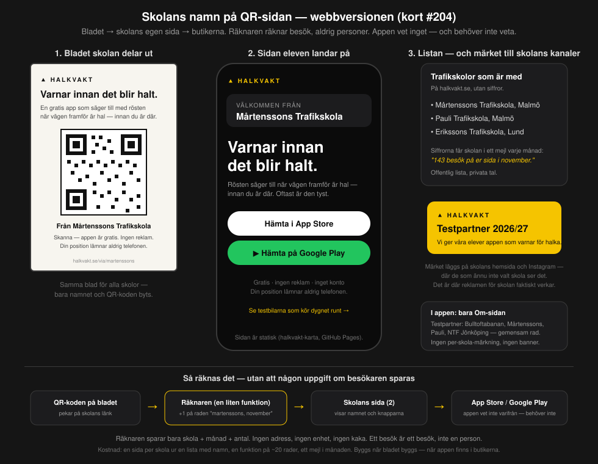

# QR-sida per skola — förberedd, inte byggd

**Status: BESLUTAT AV BENGT 2026-09-19 (DECISIONS #241) — förberedd, byggs när bladet byggs.** Kort #204. Till Axel för
bedömning av den tekniska formen (§6). Inget är byggt.

## 0. Sammanfattning

Trafikskolorna som är med ska synas som de som gav eleven appen. Det görs **på webben, inte i appen**: bladet skolan
delar ut har skolans namn och en QR-kod till skolans egen sida, sidan säger *"Välkommen från Mårtenssons Trafikskola"*
och leder till butikerna, och en räknare räknar besök per skola och månad — aldrig personer. Skolan får sina tal i ett
mejl, en lista på startsidan visar vilka som är med, och ett märke går att lägga på skolans egen hemsida. I appen finns
ingen banner och ingen märkning per skola. Bygget tar ungefär en timme och görs när appen finns i butikerna.

## 1. Varför webben och inte appen

| I appen (avvisat) | På webben (beslutat) |
| :-- | :-- |
| Eleven som ser bannern är redan skolans kund — reklam till egna kunder säljer inget | Sidan ser alla som skannar: också föräldrar och kompisar |
| Bryter mot *tyst app utan reklam*, som också är ett säljargument mot skolorna | Appen förblir orörd |
| iPhone ger appen ingen uppgift om vilken länk installationen kom från — hälften av eleverna skulle sakna avsändare | Räknaren sitter före butiken och ser alla |
| "Kom via skola X" är en uppgift om användaren; löftet till allmänheten är *vi samlar in: ingenting* | Räknaren sparar skola, månad, antal — inget om besökaren |

## 2. Delarna

| # | Del | Innehåll | Var |
| :-- | :-- | :-- | :-- |
| 1 | **Skolregistret** | en fil med rad per skola: kortnamn (`martenssons`), namn, ort, kontaktperson, datum för muntligt ja | Halkvakt-repot, `docs/skolor.json` eller motsvarande |
| 2 | **Skolans sida** | *Välkommen från [skola]* · appens budskap · knapparna App Store / Google Play · *gratis, ingen reklam, positionen lämnar aldrig telefonen* · länk till testbilarna | en statisk sida per skola, byggd ur registret, på Pages (halkvakt-karta): `via/martenssons.html` |
| 3 | **Räknaren** | QR-koden pekar på en liten funktion: `+1` på raden *(skola, månad)* och vidare till skolans sida. Sparar inget om besökaren | Supabase edge function `via` + tabell `via_besok(skola, manad, antal)` |
| 4 | **Månadsmejlet** | *"143 besök på er sida i november"* — Bengt skickar, talen hämtas med en dbknapp-fråga | manuellt, en gång i månaden |
| 5 | **Partnerlistan** | *Trafikskolor som är med* på startsidan, utan siffror | halkvakt-karta |
| 6 | **Märket** | gul etikett *Testpartner 2026/27 — vi ger våra elever appen som varnar för halka*, som bild att ladda ner | halkvakt-karta, `via/marke.svg` |
| 7 | **Bladet** | A5, samma för alla: rubrik, tre rader text, QR-koden, *Från [skola]*; QR-koden görs lokalt (ingen tredjepartstjänst) | Halkvakt-repot, mall + skript som fyller i namn och kod |
| 8 | **Appen** | Om-sidans rad *Testpartner: Bulltoftabanan, Mårtenssons, Pauli, NTF Jönköping* — gemensam, ingen banner | Android + iOS, i det bygge som ändå går ut |

## 3. Kedjan

QR-koden → räknaren (`…/functions/v1/via/martenssons`: `+1`, svar 302) → skolans sida (`halkvakt.se/via/martenssons`) →
App Store / Google Play. Appen vet inte varifrån den kom, och behöver inte veta.

## 4. Integriteten — vad som sparas

- **Sparas:** skola, månad, antal. Ingen adress, ingen enhet, ingen kaka, ingen tidpunkt per besök.
- **Sparas inte av oss:** besökarens IP eller webbläsare. Supabase egen driftlogg kan innehålla anropets adress under
  sin korta lagringstid; vi läser den inte, sparar den inte och bygger inget på den. Det står i texten på sidan.
- **Ett besök är ett besök**, inte en person och inte en installation. Talet till skolan är "besök på er sida".
- Löftet i appen (*vi samlar in: ingenting*) rörs inte: ingenting av detta sker i appen.

## 5. Vad som måste finnas innan bladet trycks

En tryckt QR-kod går inte att ändra. Därför, i ordning:

1. **Domänen.** `halkvakt.se/via/martenssons` på bladet kräver att domänen finns och pekar på Pages. Utan domän blir
   länken `axelstar.github.io/halkvakt-karta/via/martenssons` — den fungerar, men får aldrig bytas efter tryck.
   Driftbudgeten i ansökan täcker domän (12 000 kr, 15 månader, inklusive domän).
2. **Räknarens adress** måste också vara den slutliga: QR-koden pekar på funktionen, inte på sidan.
3. **Skolregistret** med de skolor som sagt ja (kortnamn låses — det står i QR-koden).
4. **Appen i butikerna** — sidan får inte leda till en butik där appen inte finns.

## 6. Vad Axel ska bedöma

| # | Beslut | Claudes rekommendation |
| :-- | :-- | :-- |
| 1 | Domän: `halkvakt.se` (eller annan) registreras före tryck; vem registrerar | ja, Axel (kontot), före bladet |
| 2 | Sidorna på Pages i halkvakt-karta, byggda ur registret av ett skript i Halkvakt-repot som pushar som `push-data.ts` | ja |
| 3 | Räknaren som Supabase-funktion `via` + tabell `via_besok`, öppen utan nyckel (den ska nås av vem som helst) | ja |
| 4 | Skydd mot skräpbesök (någon som skannar hundra gånger) | nej i första versionen — talet är inte pengar; ett tak per minut kan läggas till om det behövs |
| 5 | Märkets utformning: gult/svart, *Testpartner 2026/27* | ja; texten kan Axel ändra |
| 6 | Om-sidans gemensamma testpartner-rad i nästa appbygge | ja, i 0.3.9 med #203 |
| 7 | Tidpunkt: byggs när bladet byggs, alltså när appen finns i butikerna | ja — inget före |

## 7. Kostnad

- **Bygge:** registret + sidmall + skript ~30 min · funktionen + tabellen ~20 min · märket och bladmallen ~30 min.
  Inga Actions-minuter av betydelse (Pages bygger i karta-repot).
- **Drift:** domänen, inom driftbudgeten. Räknaren kostar inget på gratisnivån.
- **Löpande:** ett mejl per skola och månad, Bengt.

## 8. Bevis (Verify)

1. En skolas sida visar skolans namn och båda butiksknapparna, på domänen som står på bladet.
2. Ett skannat blad ger `+1` på rätt rad i `via_besok`, och raden bär bara skola, månad, antal.
3. Partnerlistan visar skolorna som sagt ja; märket går att ladda ner.
4. Appen: Om-sidan visar testpartner-raden; ingen annan ändring i appen.
