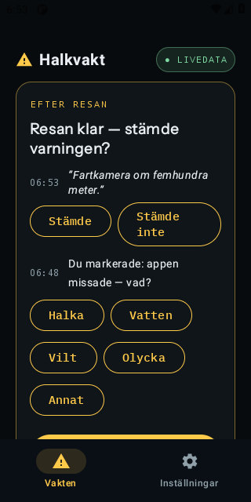
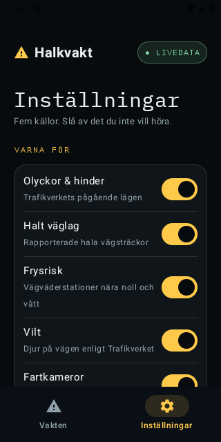
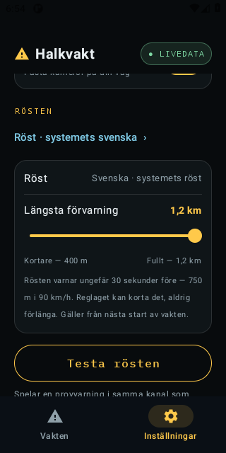
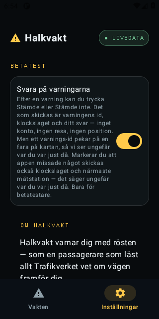
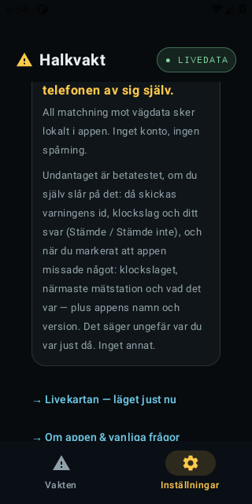

# Bilaga 6 — Appen: skärmbilder och rösttexter

*Halkvakt, ansökan till Skyltfonden 2026. Skärmbilderna är från Android-appen, version 0.3.9, tagna automatiskt 26 september 2026. iPhone-appen har samma funktioner. Rösttexterna är ordagranna ur varningsmotorn, som är gemensam för server, Android och iOS.*

<figure><figcaption><b>Efter resan.</b> Föraren svarar i efterhand om varningen stämde, eller markerar vad appen missade.</figcaption></figure>
<figure><figcaption><b>Varna för.</b> Fem slags faror, var och en går att stänga av.</figcaption></figure>
<figure><figcaption><b>Rösten.</b> Varningen kommer omkring 30 sekunder före faran. Reglaget kan korta förvarningen, aldrig förlänga den.</figcaption></figure>
<figure><figcaption><b>Betatest.</b> Förarsvaren är avslagna från början, och texten säger exakt vad som skickas.</figcaption></figure>
<figure><figcaption><b>Om Halkvakt.</b> Integritetslöftet i appen: all matchning sker lokalt, och undantaget beskrivs ordagrant.</figcaption></figure>

## Rösttexterna

Rösten säger bara det datan bär. En sträcka ur Trafikverkets väglag får sägas vara *på vägen framför dig*. En punktmätning, som en station eller ett djur, säger *framöver* och aldrig ett avstånd som mätningen inte stöder.

| Fara | Vad rösten säger |
| :-- | :-- |
| Halka rapporterad (Trafikverkets väglag) | *"Varning: halka rapporterad på vägen framför dig."* |
| Isrisk vid mätstation (yta ≤ 1 °C och fukt) | *"Isrisk framöver — vägbanan nära noll grader."* |
| Frysrisk på bro (yta ≤ 3 °C vid kall, blöt station) | *"Frysrisk framöver — bro om 600 meter."* |
| Olycka | *"Olycka rapporterad på E22 4 kilometer framför dig."* |
| Allvarlig olycka, första varningen (cirka 10 km före) | *"Allvarlig olycka på E22 9 kilometer framför dig — stor påverkan på trafiken. Överväg annan väg. Beräknas röjd vid 07:40."* |
| Allvarlig olycka, påminnelse (2 km före) | *"Sakta ner — olycksplats strax framför dig."* |
| Djur på vägen (Trafikverket) | *"Viltrisk framöver."* |
| Fartkamera som bevakar din färdriktning | *"Fartkamera om 500 meter. Gränsen är 80."* |
| Gammal data (en gång per körning) | *"Ingen färsk väglagsdata – kör som om det kan vara halt."* |

Vägnummer, avstånd, klockslag och hastighetsgräns i exemplen fylls i ur datan vid varningstillfället.

## Hur rösten väljer

- **En fara per ögonblick.** Ordningen är olycka, halka, frysrisk, vilt, fartkamera. De som förlorar släpps och köas aldrig.
- **Tio sekunders spärr.** Inom 10 sekunder efter en varning får bara en viktigare fara tala.
- **Ingen upprepning.** Samma fara upprepas först efter minst 10 minuter och 5 km.
- **Tyst som standard.** Rösten talar bara vid mätt eller rapporterad risk. Under ett dygn i skuggmotorns logg (16 september 2026) kom 0 av 110 yttranden inom 60 sekunder efter ett annat.
